L.POINT Big Data Competition
================
장은아 (<dmsdk2121@gmail.com>)
2017.12.18

#### 주제 : 스마트 라이프 큐레이터

1.  분석 목적 : 고객의 니즈와 취향에 맞는 맞춤형 콘텐츠 제안
2.  데이터 구성 :
    고객의 1년간의 상품 구매 패턴 및 이용 업종이용 데이터
    ( 2015년 1년간 롯데그룹의 14개의 계열사에서 구매한 고객)

-   고객의 성향 및 라이프 스타일 파악
-   고객의 니즈와 취향에 맞는 상품 및 서비스 등 맞춤형 콘텐츠 제안

``` r
library(dplyr)
```

    ## 
    ## Attaching package: 'dplyr'

    ## The following objects are masked from 'package:stats':
    ## 
    ##     filter, lag

    ## The following objects are masked from 'package:base':
    ## 
    ##     intersect, setdiff, setequal, union

``` r
library(ggplot2)
library(ISLR)
library(MASS)
```

    ## 
    ## Attaching package: 'MASS'

    ## The following object is masked from 'package:dplyr':
    ## 
    ##     select

``` r
library(glmnet)
```

    ## Loading required package: Matrix

    ## Loading required package: foreach

    ## Loaded glmnet 2.0-13

``` r
library(data.table)
```

    ## 
    ## Attaching package: 'data.table'

    ## The following objects are masked from 'package:dplyr':
    ## 
    ##     between, first, last

``` r
library(gridExtra)
```

    ## 
    ## Attaching package: 'gridExtra'

    ## The following object is masked from 'package:dplyr':
    ## 
    ##     combine

``` r
library(ggfortify)
library(Hmisc)
```

    ## Loading required package: lattice

    ## Loading required package: survival

    ## Loading required package: Formula

    ## 
    ## Attaching package: 'Hmisc'

    ## The following object is masked from 'package:gridExtra':
    ## 
    ##     combine

    ## The following objects are masked from 'package:dplyr':
    ## 
    ##     combine, src, summarize

    ## The following objects are masked from 'package:base':
    ## 
    ##     format.pval, round.POSIXt, trunc.POSIXt, units

``` r
library(mclust)
```

    ## Package 'mclust' version 5.3

    ## Type 'citation("mclust")' for citing this R package in publications.

``` r
library(fastcluster)
```

    ## 
    ## Attaching package: 'fastcluster'

    ## The following object is masked from 'package:stats':
    ## 
    ##     hclust

``` r
library(cluster)
```

1.  데이터 로드하기

``` r
### 01. sourcing (import and preprocess) ---------------------------------------------

setwd("/Users/jang-eun-a/Desktop/lottebigdata")

# 고객정보 : ID, 성별, 연령대, 거주지
demo.df <- read.table("demo.txt", sep = ",", header = T)
# head(demo.df)
glimpse(demo.df)
```

    ## Observations: 20,000
    ## Variables: 4
    ## $ ID         <int> 1, 2, 3, 4, 5, 6, 7, 8, 9, 10, 11, 12, 13, 14, 15, ...
    ## $ GENDER     <int> 1, 2, 2, 1, 1, 2, 2, 2, 2, 1, 1, 2, 2, 1, 2, 2, 2, ...
    ## $ AGE_PRD    <fct> 60PRD, 60PRD, 60PRD, 60PRD, 60PRD, 60PRD, 60PRD, 60...
    ## $ HOM_PST_NO <int> 52, 80, 620, 120, NA, 58, 52, 480, 470, 55, 72, 61,...

총 고객ID는 20,000개이다.

``` r
demo.dt <- as.data.table(demo.df)
# AGE_PRD 나이 데이터 수정
demo.dt[, AGE_PRD := gsub("PRD", "",AGE_PRD)]  
demo.dt[,AGE_PRD := as.numeric(AGE_PRD)]
# 성별,ID,거주지 데이터 factor로 변환
demo.dt[,GENDER := factor(GENDER)]
demo.dt[,ID := factor(ID)]
demo.dt[,HOM_PST_NO := factor(HOM_PST_NO)]

summary(demo.dt)
```

    ##        ID        GENDER       AGE_PRD        HOM_PST_NO   
    ##  1      :    1   1: 7815   Min.   :20.00   100    : 1004  
    ##  2      :    1   2:12185   1st Qu.:30.00   55     :  914  
    ##  3      :    1             Median :40.00   160    :  595  
    ##  4      :    1             Mean   :40.19   470    :  594  
    ##  5      :    1             3rd Qu.:50.00   130    :  539  
    ##  6      :    1             Max.   :60.00   (Other):14989  
    ##  (Other):19994                             NA's   : 1365

2만개 ID중 여자고객이 더 많으며, 30,40,50대 고객이 주를 이룬다.

``` r
# 나이별 성별(남 1, 여 2)차지하는 비율 시각화 
demo.dt %>%
  ggplot(aes(AGE_PRD, fill=GENDER)) +
  geom_bar() +
  geom_density(alpha=.5)
```

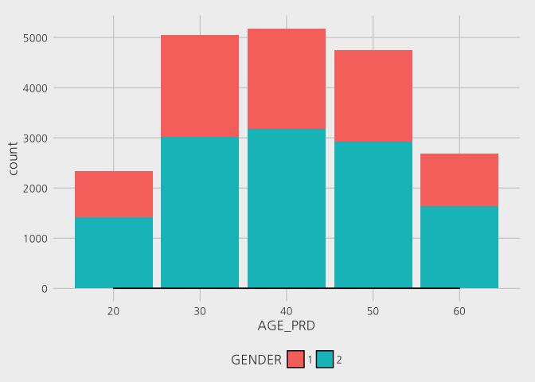

``` r
# 상품구매정보 : ID, 영수증번호, 업종, 상품 소분류 코드, 점포코드, 구매일자, 구매시간, 구매금액, 구매수량
shop.df <- read.table("shopping_data.txt", sep = ",", header = T)
# head(shop.df)
glimpse(shop.df)
```

    ## Observations: 3,641,082
    ## Variables: 9
    ## $ ID       <int> 4008, 6379, 6379, 8002, 8002, 8002, 7252, 5072, 5072,...
    ## $ RCT_NO   <int> 2108, 2109, 2109, 2110, 2110, 2110, 2111, 2112, 2112,...
    ## $ BIZ_UNIT <fct> A01, A01, A01, A01, A01, A01, A01, A01, A01, A01, A01...
    ## $ PD_S_C   <int> 215, 75, 149, 138, 138, 558, 13, 223, 216, 121, 121, ...
    ## $ BR_C     <int> 2, 29, 4, 10, 10, 4, 29, 2, 2, 2, 2, 37, 37, 1, 2, 29...
    ## $ DE_DT    <int> 20150216, 20150213, 20150115, 20151220, 20151220, 201...
    ## $ DE_HR    <int> 13, 11, 10, 10, 10, 10, 10, 12, 12, 11, 11, 14, 14, 1...
    ## $ BUY_AM   <int> 59600, 35000, 85000, 25000, 21000, 79200, 5400, 15800...
    ## $ BUY_CT   <int> 2, 1, 1, 1, 1, 1, 1, 1, 1, 1, 2, 1, 1, 1, 1, 1, 1, 1,...

``` r
## 전처리
# 중복된 행 제거 
shop.df <- unique(shop.df)
dim(shop.df) # 3,641,082 건에서 중복되는 건수 제거. 제거 후  3,480,983건 
```

    ## [1] 3480983       9

``` r
# 구매금액 BUY_AM 이 0원인 건(3053건) 제거
shop.df <- shop.df[shop.df$BUY_AM != 0,]

shop.dt <- as.data.table(shop.df)

# factor로 변환
shop.dt[,ID := factor(ID)]
shop.dt[,RCT_NO := factor(RCT_NO)]
shop.dt[,PD_S_C := factor(PD_S_C)]
shop.dt[,BR_C := factor(BR_C)]
# PD_H_NM 서비스상품, 기타(비상품)구매건 삭제
shop.dt <- shop.dt[!(BIZ_UNIT == "A05" & PD_S_C == "140"),]
shop.dt <- shop.dt[!(BIZ_UNIT == "A05" & PD_S_C == "141"),]
shop.dt <- shop.dt[!(BIZ_UNIT == "A05" & PD_S_C == "142"),]

shop.df <- as.data.frame(shop.dt)

summary(shop.dt)
```

    ##        ID              RCT_NO        BIZ_UNIT          PD_S_C       
    ##  16742  :   3643   17045  :    111   A01: 890223   1620   :  39208  
    ##  9677   :   3269   17133  :    109   A02:1667981   60     :  38598  
    ##  9990   :   3161   16229  :    105   A03: 723939   679    :  33599  
    ##  178    :   3047   15253  :    102   A04: 177570   210    :  33187  
    ##  12178  :   2433   9371   :    101   A05:  17467   1232   :  30095  
    ##  1077   :   2297   17044  :    101                 145    :  29038  
    ##  (Other):3459330   (Other):3476551                 (Other):3273455  
    ##       BR_C             DE_DT              DE_HR          BUY_AM         
    ##  7      : 260894   Min.   :20141229   Min.   : 0.0   Min.   :        4  
    ##  2      : 209461   1st Qu.:20150403   1st Qu.:14.0   1st Qu.:     2000  
    ##  13     : 122937   Median :20150630   Median :16.0   Median :     4500  
    ##  16     :  96099   Mean   :20150621   Mean   :16.3   Mean   :    25556  
    ##  1      :  79227   3rd Qu.:20150925   3rd Qu.:19.0   3rd Qu.:    10000  
    ##  29     :  75132   Max.   :20151231   Max.   :23.0   Max.   :166030000  
    ##  (Other):2633430                                                        
    ##      BUY_CT        
    ##  Min.   :    1.00  
    ##  1st Qu.:    1.00  
    ##  Median :    1.00  
    ##  Mean   :   12.99  
    ##  3rd Qu.:    1.00  
    ##  Max.   :10050.00  
    ## 

-   구매데이터에서 업종별 건수는
    대형마트(A02) &gt; 백화점(A01) &gt; 슈퍼마켓(A03) &gt; 편의점(A04) &gt; 드럭스토어(A05) 순이다.
-   BUY\_AM 구매금액에서 MAX값은 166030000원이며 30대 남성고객의 수입의류/명품구입건 이다.
-   구매일자는 2014.12.29부터 2015.12.31까지이고 구매시간은 0시부터 23시이다.

``` r
# 구매금액 그래프로 나타내기
shop.dt %>%
  ggplot(aes(x = BIZ_UNIT, y = BUY_AM)) +
  geom_boxplot(width=0.8, outlier.size=3, outlier.shape=16, outlier.colour="red") +
  stat_summary(fun.y="mean", geom="point", shape=21, size=3, fill="blue")
```

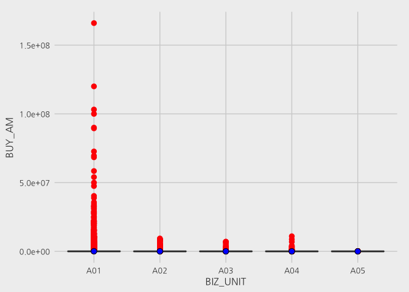 업종별 구매금액 범위 차이가 크다. 백화점(A01)에서 가장 금액이 큰 구매건이 많이 나타난다.

``` r
# 시간대별 구매건수, 쇼핑업종 비율 시각화 
shop.dt %>%
  ggplot(aes(DE_HR, fill=BIZ_UNIT)) +
  geom_bar() +
  geom_density(alpha=.5)
```

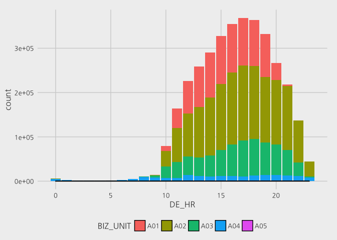 A01:백화점, A02:대형마트, A03:슈퍼마켓, A04:편의점, A05:드러그스토어

``` r
# 쇼핑외 이용정보 : ID, 업종, 이용월, 이용금액, 이용건수
using.df <- read.table("using_data.txt", sep = ",", header = T)
# head(using.df)
glimpse(using.df)
```

    ## Observations: 178,659
    ## Variables: 5
    ## $ ID       <int> 9544, 9544, 9544, 9544, 9544, 9544, 9544, 9544, 9544,...
    ## $ BIZ_UNIT <fct> D03, C01, D01, D01, D03, D01, D01, B03, C01, D01, C01...
    ## $ CRYM     <int> 201511, 201510, 201508, 201507, 201505, 201512, 20151...
    ## $ U_AM     <int> 14400, 18000, 9500, 4200, 3900, 26000, 9500, 314283, ...
    ## $ U_CT     <int> 1, 1, 2, 1, 1, 3, 1, 5, 3, 1, 1, 1, 4, 1, 2, 1, 1, 5,...

``` r
using.dt <- as.data.table(using.df)
using.dt[,ID := factor(ID)]
summary(using.dt)
```

    ##        ID            BIZ_UNIT          CRYM             U_AM         
    ##  15033  :    53   C01    :60039   Min.   :201501   Min.   :      13  
    ##  6922   :    52   D01    :42757   1st Qu.:201504   1st Qu.:    8525  
    ##  3065   :    47   D03    :38191   Median :201507   Median :   15700  
    ##  2027   :    43   B03    :17635   Mean   :201507   Mean   :   68150  
    ##  5267   :    43   C02    :12596   3rd Qu.:201509   3rd Qu.:   33800  
    ##  7348   :    43   B01    : 3757   Max.   :201512   Max.   :68971815  
    ##  (Other):178378   (Other): 3684                                      
    ##       U_CT        
    ##  Min.   :  1.000  
    ##  1st Qu.:  1.000  
    ##  Median :  1.000  
    ##  Mean   :  1.827  
    ##  3rd Qu.:  2.000  
    ##  Max.   :131.000  
    ## 

``` r
using.dt %>%
  ggplot(aes(x = BIZ_UNIT, y = U_CT)) +
  geom_boxplot(width=0.8, outlier.size=3, outlier.shape=16, outlier.colour="red") +
  stat_summary(fun.y="mean", geom="point", shape=21, size=3, fill="blue")
```

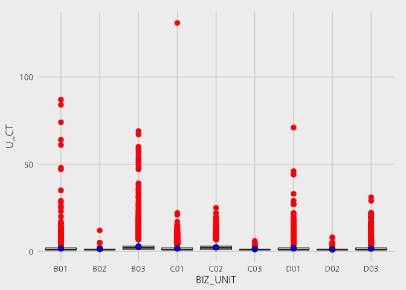

``` r
# 상품 정보 : 업종, 상품 소분류 코드, 소분류명, 중분류명, 대분류명
pd.df <- read.table("pd_data.txt", sep = ",", header = T)
head(pd.df)
```

    ##   BIZ_UNIT PD_S_C          PD_S_NM    PD_M_NM   PD_H_NM
    ## 1      A04    341 단행본서적(직배) 특수점서적 서적/음반
    ## 2      A04      1         삼각김밥   삼각김밥      미반
    ## 3      A04      2  The커진삼각김밥   삼각김밥      미반
    ## 4      A04      3         말이김밥       김밥      미반
    ## 5      A04      4       트레이김밥       김밥      미반
    ## 6      A04      5             초밥       김밥      미반

``` r
# glimpse(pd.df)
pd.dt <- as.data.table(pd.df)
```

``` r
### 02. exploration ----------------------------------------------------

# 고객정보(demo.dt)와 쇼핑구매정보(shop.dt) 병합
join_demo_shop <- as.data.table(right_join(demo.dt, shop.dt, by = "ID"))
```

    ## Warning: Column `ID` joining factors with different levels, coercing to
    ## character vector

``` r
# head(join_demo_shop)
# View(join_demo_shop)
setkey(join_demo_shop, BIZ_UNIT, PD_S_C)
join_demo_shop <- merge(join_demo_shop, pd.dt[,c(1,2,5), with = F], all.x=TRUE)

# 쇼핑 외 업종 이용정보(using.dt)와 고객정보(demo.dt) 병합
join_demo_using <- as.data.table(right_join(demo.dt, using.dt, by = "ID"))
```

    ## Warning: Column `ID` joining factors with different levels, coercing to
    ## character vector

``` r
# head(join_demo_using)
# View(join_demo_using)

# 전체 이용횟수 
dt1 <- join_demo_shop[, .N, by = "ID"]
# head(dt1[order(dt1$N, decreasing = TRUE),], 20)

## 업종별 이용횟수와 총 이용금액 
# 쇼핑 업종 이용정보 
dt2 <- join_demo_shop[, list(.N, TOTAL_SP = sum(BUY_AM)), by = "ID,BIZ_UNIT"]
# head(dt2[order(dt2$ID, dt2$BIZ_UNIT),],30)
setkey(dt2, ID)
dt2 <- merge(dt2, demo.dt[,c(1,2,3), with = F], all.x=TRUE)

ggplot(dt2, aes(N, TOTAL_SP)) + geom_point(aes(color=BIZ_UNIT))
```

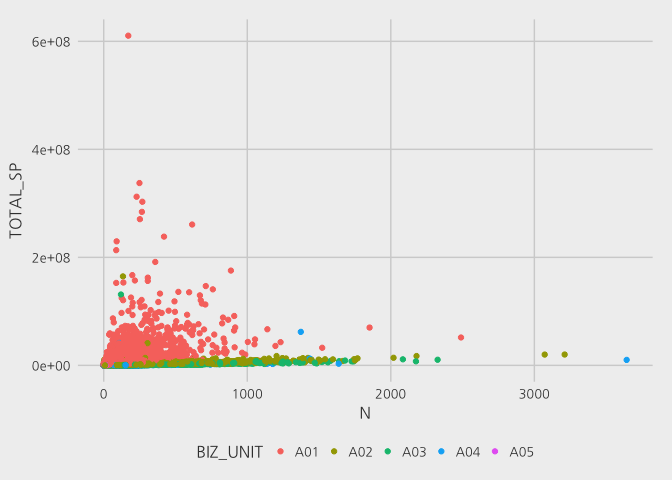

``` r
ggplot(dt2, aes(N, TOTAL_SP)) + geom_point(aes(color=BIZ_UNIT))+
  xlim(0,2000) + ylim(0,3e+08) #범위조정
```

    ## Warning: Removed 13 rows containing missing values (geom_point).

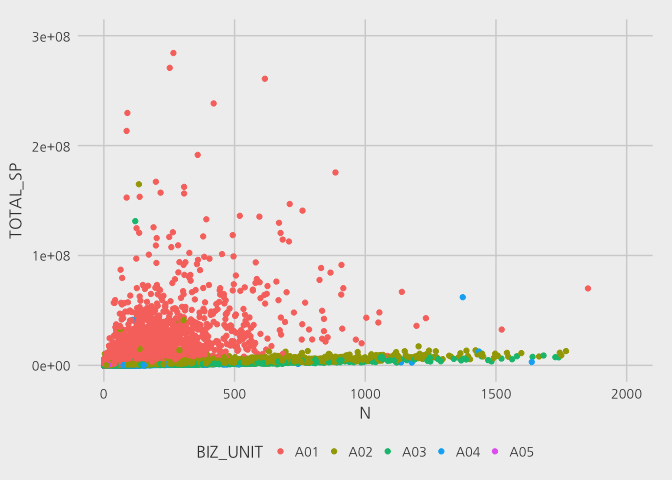

``` r
p1 <- ggplot(subset(dt2,BIZ_UNIT == "A01"), aes(N, TOTAL_SP)) +
  geom_point(aes(color=GENDER)) + xlim(0,1500) + ylim(0,3e+08) + 
  labs(title = "백화점", x = "총 방문횟수", y = "총 사용금액")
p2 <- ggplot(subset(dt2,BIZ_UNIT == "A02"), aes(N, TOTAL_SP)) +
  geom_point(aes(color=GENDER)) + xlim(0,2000) + ylim(0,2e+07) +
    labs(title = "대형마트", x = "총 방문횟수", y = "총 사용금액")
p3 <- ggplot(subset(dt2,BIZ_UNIT == "A03"), aes(N, TOTAL_SP)) +
  geom_point(aes(color=GENDER)) + xlim(0,1500) + ylim(0,7.5e+06) +
    labs(title = "슈퍼마켓", x = "총 방문횟수", y = "총 사용금액")
p4 <- ggplot(subset(dt2,BIZ_UNIT == "A04"), aes(N, TOTAL_SP)) +
  geom_point(aes(color=GENDER)) + xlim(0,500) + ylim(0,3e+06) +
    labs(title = "편의점", x = "총 방문횟수", y = "총 사용금액")
p5 <- ggplot(subset(dt2,BIZ_UNIT == "A05"), aes(N, TOTAL_SP)) +
  geom_point(aes(color=GENDER)) + xlim(0,75) + ylim(0,600000) +
    labs(title = "드러그스토어", x = "총 방문횟수", y = "총 사용금액")

grid.arrange(p1,p2,p3,p4,p5,ncol = 3, nrow = 2)
```

    ## Warning: Removed 7 rows containing missing values (geom_point).

    ## Warning: Removed 8 rows containing missing values (geom_point).

    ## Warning: Removed 16 rows containing missing values (geom_point).

    ## Warning: Removed 12 rows containing missing values (geom_point).

    ## Warning: Removed 9 rows containing missing values (geom_point).

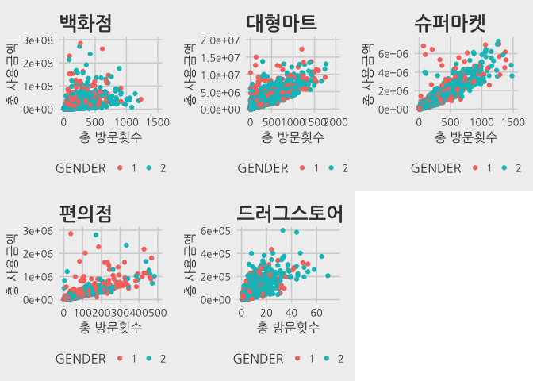

``` r
# 백화점 이용객 조사 
p1
```

    ## Warning: Removed 7 rows containing missing values (geom_point).

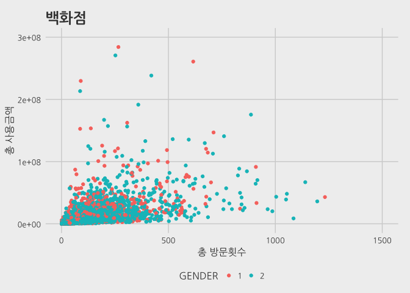

``` r
user.a01 <- subset(dt2,BIZ_UNIT == "A01")
summary(user.a01)
```

    ##        ID        BIZ_UNIT          N              TOTAL_SP        
    ##  1      :    1   A01:15637   Min.   :   1.00   Min.   :      530  
    ##  10     :    1   A02:    0   1st Qu.:   8.00   1st Qu.:   387000  
    ##  100    :    1   A03:    0   Median :  27.00   Median :  1439100  
    ##  1000   :    1   A04:    0   Mean   :  56.93   Mean   :  4604039  
    ##  10001  :    1   A05:    0   3rd Qu.:  71.00   3rd Qu.:  4194250  
    ##  10002  :    1               Max.   :2489.00   Max.   :610453590  
    ##  (Other):15631                                                    
    ##  GENDER      AGE_PRD     
    ##  1:5721   Min.   :20.00  
    ##  2:9916   1st Qu.:30.00  
    ##           Median :40.00  
    ##           Mean   :40.46  
    ##           3rd Qu.:50.00  
    ##           Max.   :60.00  
    ## 

``` r
# 대형마트 이용객 조사 
p2
```

    ## Warning: Removed 8 rows containing missing values (geom_point).

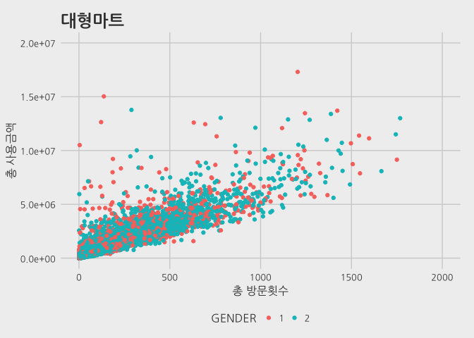

``` r
user.a02 <- subset(dt2,BIZ_UNIT == "A02")
summary(user.a02)
```

    ##        ID        BIZ_UNIT          N             TOTAL_SP         GENDER  
    ##  1      :    1   A01:    0   Min.   :   1.0   Min.   :      880   1:5181  
    ##  100    :    1   A02:13538   1st Qu.:  12.0   1st Qu.:   103505   2:8357  
    ##  10000  :    1   A03:    0   Median :  45.0   Median :   376148           
    ##  10001  :    1   A04:    0   Mean   : 123.2   Mean   :   960883           
    ##  10002  :    1   A05:    0   3rd Qu.: 149.0   3rd Qu.:  1171165           
    ##  10003  :    1               Max.   :3211.0   Max.   :164803454           
    ##  (Other):13532                                                            
    ##     AGE_PRD     
    ##  Min.   :20.00  
    ##  1st Qu.:30.00  
    ##  Median :40.00  
    ##  Mean   :40.27  
    ##  3rd Qu.:50.00  
    ##  Max.   :60.00  
    ## 

``` r
# 슈퍼마켓 이용객 조사 
p3
```

    ## Warning: Removed 16 rows containing missing values (geom_point).

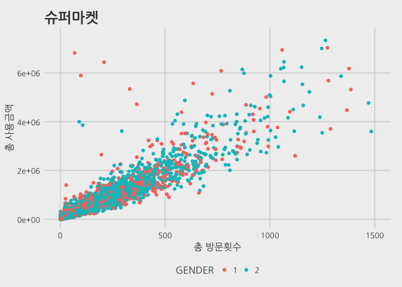

``` r
user.a03 <- subset(dt2,BIZ_UNIT == "A03")
summary(user.a03)
```

    ##        ID       BIZ_UNIT         N              TOTAL_SP         GENDER  
    ##  1000   :   1   A01:   0   Min.   :   1.00   Min.   :      400   1:2821  
    ##  10004  :   1   A02:   0   1st Qu.:   6.00   1st Qu.:    22702   2:5001  
    ##  10008  :   1   A03:7822   Median :  21.00   Median :    83647           
    ##  10010  :   1   A04:   0   Mean   :  92.55   Mean   :   402215           
    ##  10012  :   1   A05:   0   3rd Qu.:  91.00   3rd Qu.:   364155           
    ##  10013  :   1              Max.   :2326.00   Max.   :131243556           
    ##  (Other):7816                                                            
    ##     AGE_PRD     
    ##  Min.   :20.00  
    ##  1st Qu.:30.00  
    ##  Median :40.00  
    ##  Mean   :40.61  
    ##  3rd Qu.:50.00  
    ##  Max.   :60.00  
    ## 

``` r
# 백화점 이용객 조사 
p4
```

    ## Warning: Removed 12 rows containing missing values (geom_point).

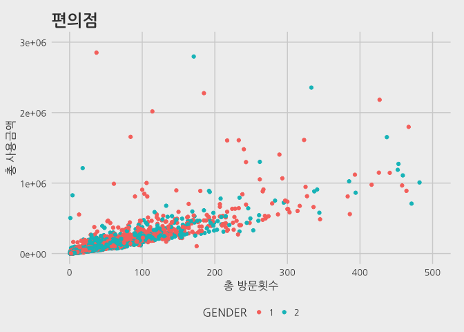

``` r
user.a04 <- subset(dt2,BIZ_UNIT == "A04")
summary(user.a04)
```

    ##        ID       BIZ_UNIT         N              TOTAL_SP        GENDER  
    ##  10008  :   1   A01:   0   Min.   :   1.00   Min.   :     200   1:2512  
    ##  10020  :   1   A02:   0   1st Qu.:   3.00   1st Qu.:    6800   2:3208  
    ##  10024  :   1   A03:   0   Median :   9.00   Median :   22235           
    ##  10026  :   1   A04:5720   Mean   :  31.04   Mean   :  100717           
    ##  10027  :   1   A05:   0   3rd Qu.:  36.00   3rd Qu.:   84338           
    ##  1004   :   1              Max.   :3643.00   Max.   :62013640           
    ##  (Other):5714                                                           
    ##     AGE_PRD     
    ##  Min.   :20.00  
    ##  1st Qu.:30.00  
    ##  Median :40.00  
    ##  Mean   :37.97  
    ##  3rd Qu.:50.00  
    ##  Max.   :60.00  
    ## 

``` r
# 백화점 이용객 조사 
p5
```

    ## Warning: Removed 9 rows containing missing values (geom_point).

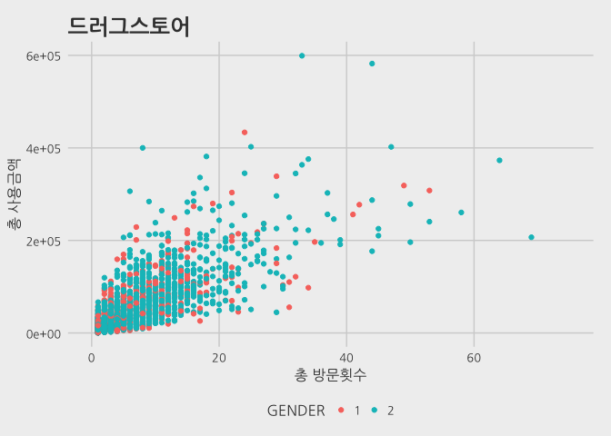

``` r
user.a05 <- subset(dt2,BIZ_UNIT == "A05")
summary(user.a05)
```

    ##        ID       BIZ_UNIT         N              TOTAL_SP       GENDER  
    ##  10004  :   1   A01:   0   Min.   :  1.000   Min.   :    700   1: 700  
    ##  10008  :   1   A02:   0   1st Qu.:  2.000   1st Qu.:  13060   2:1761  
    ##  10013  :   1   A03:   0   Median :  5.000   Median :  32680           
    ##  10023  :   1   A04:   0   Mean   :  7.098   Mean   :  56256           
    ##  10032  :   1   A05:2461   3rd Qu.:  9.000   3rd Qu.:  70200           
    ##  10043  :   1              Max.   :369.000   Max.   :2802510           
    ##  (Other):2455                                                          
    ##     AGE_PRD     
    ##  Min.   :20.00  
    ##  1st Qu.:30.00  
    ##  Median :40.00  
    ##  Mean   :37.32  
    ##  3rd Qu.:50.00  
    ##  Max.   :60.00  
    ## 

``` r
# 쇼핑 외 업종 이용정보 
dt3 <- join_demo_using[, list(TOTAL_U_CT = sum(U_CT), TOTAL_SP = sum(U_AM)), by = "ID,BIZ_UNIT"]
dt3 <- merge(dt3, demo.dt[,c(1,2,3), with = F], all.x=TRUE)
# head(dt3[order(dt3$ID, dt3$BIZ_UNIT),], 30)

# 호텔
plot1 <- ggplot(subset(dt3,BIZ_UNIT == "B01"), aes(TOTAL_U_CT, TOTAL_SP)) +
  geom_point(aes(color=AGE_PRD)) + xlim(0,30) + ylim(0,1e+07) + 
  labs(title = "호텔", x = "총 이용횟수", y = "총 사용금액")

plot1
```

    ## Warning: Removed 26 rows containing missing values (geom_point).

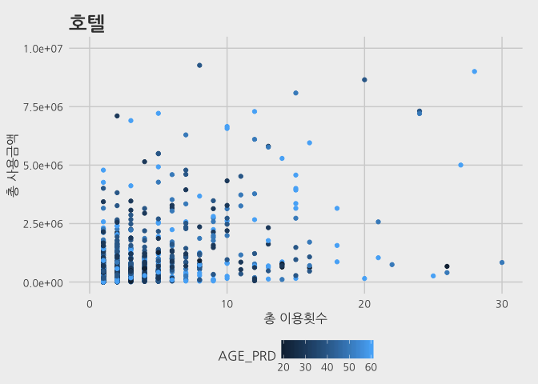

``` r
# 여행사 
plot2 <- ggplot(subset(dt3,BIZ_UNIT == "B02"), aes(TOTAL_U_CT, TOTAL_SP)) +
  geom_point(aes(color=GENDER)) + xlim(0,15) + ylim(0,1e+07) + 
  labs(title = "여행사", x = "총 이용횟수", y = "총 사용금액")

plot2
```

    ## Warning: Removed 1 rows containing missing values (geom_point).

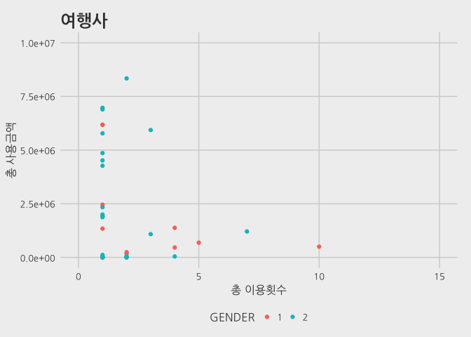

``` r
# 면세점
plot2 <- ggplot(subset(dt3,BIZ_UNIT == "B03"), aes(TOTAL_U_CT, TOTAL_SP)) +
  geom_point(aes(color=GENDER)) + xlim(0,50) + ylim(0,1e+07) + 
  labs(title = "면세점", x = "총 이용횟수", y = "총 사용금액")

plot2
```

    ## Warning: Removed 28 rows containing missing values (geom_point).

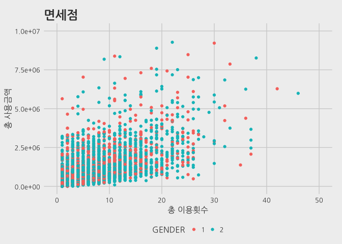

``` r
# 면세점
plot2 <- ggplot(subset(dt3,BIZ_UNIT == "C03"), aes(TOTAL_U_CT, TOTAL_SP)) +
  geom_point(aes(color=GENDER)) + xlim(0,50) + ylim(0,1e+06) + 
  labs(title = "영화관", x = "총 이용횟수", y = "총 사용금액")

plot2
```

    ## Warning: Removed 3 rows containing missing values (geom_point).

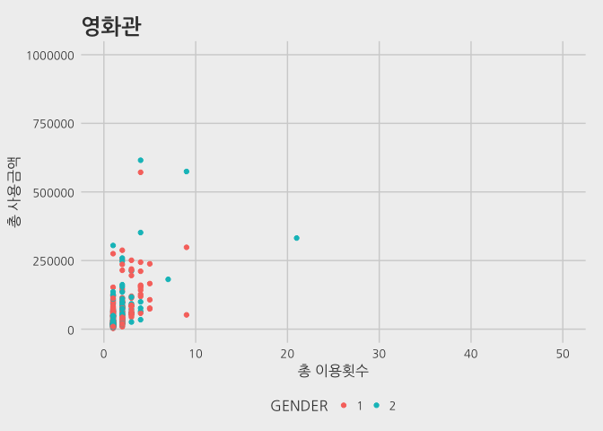

``` r
user.a01 <- subset(dt2,BIZ_UNIT == "A01")
```

``` r
# head(dt3)
dt4 <- dt3[, list(TOTAL_U = sum(TOTAL_U_CT)), by = "BIZ_UNIT"]
ggplot(dt3)
```


``` r
dt4 %>%
  ggplot(aes(x=BIZ_UNIT,y=TOTAL_U, fill=BIZ_UNIT)) +
  geom_bar(stat = "identity") +
  geom_density(alpha=.5)
```

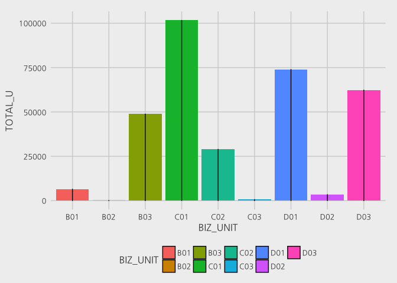 쇼핑 외 업종 이용정보 C01(영화관) &gt; D01(패스트푸트) &gt; D03(카페) &gt; B03(면세점) &gt; C02(테마파크) &gt; B01(호텔) &gt; D02(패밀리 레스토랑) &gt; C03(야구관람) &gt; B02(여행사)

``` r
# Parallel 셋팅
library(parallelMap)
library(parallel)
parallelStartSocket(cpus = detectCores())
```

    ## Starting parallelization in mode=socket with cpus=4.

``` r
# parallelStop()
```
